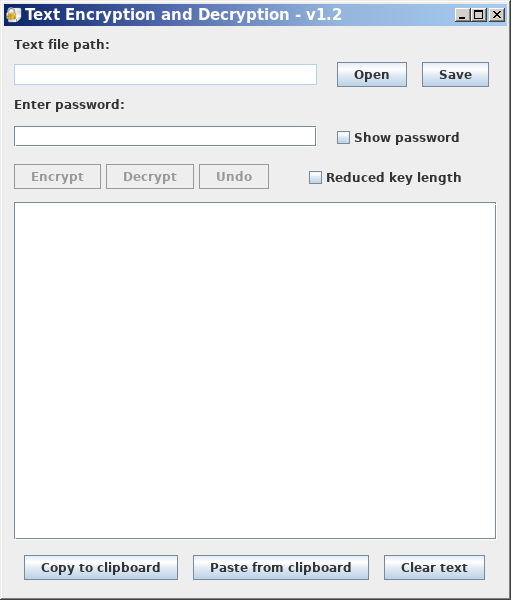

# AESTextCrypt

__Note__

This repository is a fork of the Chris Wood's original __TextCrypt__ project (see: [AESTextCrypt - Version 1.1](https://github.com/enorman1/AESTextCrypt_v1.1)).  
The new `1.2` branch (and above) adds functions to loading and saving data to a txt file.  
Graphical improvements have also been carried out with this repository.  
The "lightweight" __BouncyCastle__ package is provided to generate a smaller JAR file. 
All Java class files are located in the `bin` directory.

Please __Read__ the [history.txt](./history.txt) for more informations about the current version and older.  
Please __Read__ the [doc.txt](./doc.txt) for more informations about this software (original author: __Chris Wood__).  
The license informations are given into [legal.txt](./legal.txt) file.

__Authors__: Eric Normandin (2026) - Chris Wood (2013-2014)  



## Files source tree

```
TextCrypt/
|-- META-INF/
|   \-- MANIFEST.MF
|-- resources/
|   \-- file_locked.png
|-- bin/
|   |-- com/
|   |   \-- ceperman/
|   |       \-- ...
|   \-- org/
|       |-- mindrot/
|       |   \-- ...
|       \-- bouncycastle/
|           \-- ...
|-- src/
|   |-- com/
|   |   \-- ceperman/
|   |       \-- textcrypt/
|   |           |-- Base64.java
|   |           |-- CryptUtils.java
|   |           |-- ExpandableByteBuffer.java
|   |           |-- Messages.java
|   |           |-- Strings.java
|   |           |-- TextCrypt.java
|   |           |-- messages.properties
|   |           \-- version.properties
|   \-- org/
|       \-- mindrot/
|           \-- jbcrypt/
|               \-- BCrypt.java
|-- doc.txt
|-- history.txt
\-- legal.txt

```

## Requirements to compile source code

* Java Runtime Environment (JRE) 8 or later  
  with Java Cryptography Extension (JCE) Unlimited Strength Jurisdiction Policy Files  
* The Bouncy Castle Crypto library (a lightweight version included - with only needed classes).  
  __Unzip__ the package included on the `bin` directory.

## Compiling the source code

```bash
javac -cp "bin/" -d bin src/com/ceperman/textcrypt/*.java src/org/mindrot/jbcrypt/*.java
```

## How to execute the "TextCrypt.class"

```bash
java -cp "bin/:resources/" com.ceperman.textcrypt.TextCrypt
```
\|
\| __Note__: On Windows, replace `:` with `;` in the classpath.
\|

## Creating the `TextCrypt.jar` file

```bash
jar cvfm TextCrypt.jar META-INF/MANIFEST.MF -C bin/ . -C resources/ .
```

***

Enjoy it !
